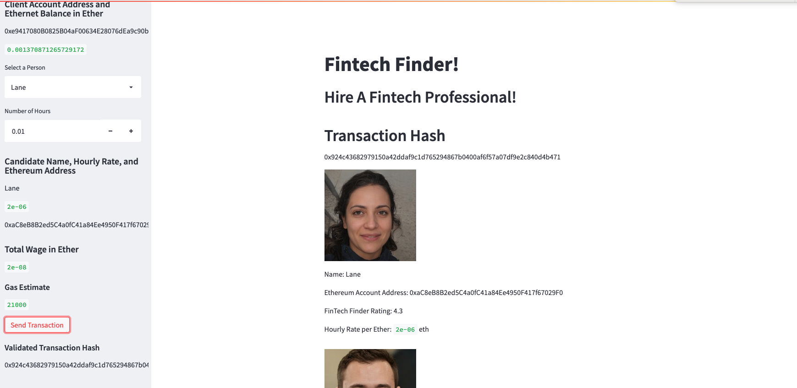
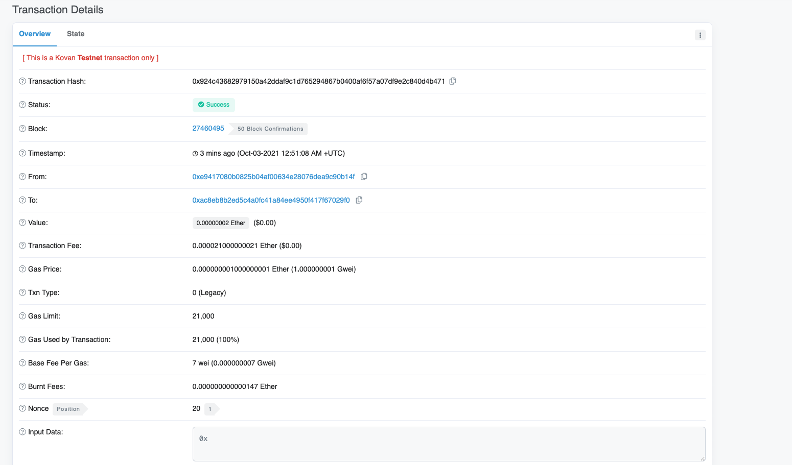

## Home Page
- Notice the gas estimate is displayed

## Transaction is sent
- The hash is displayed in main page and sidebar

## Etherscan Transaction
- The public keys of sender/receiver match on web app and etherscan

